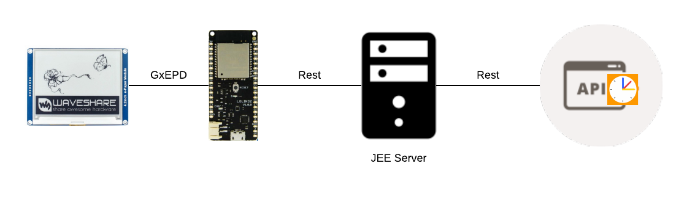

# README - DigitalDoorSignage :pushpin:

## :clipboard: Table of Contents
- [Introduction](#arrow_forward-introduction)
- [Documentation](#page_facing_up-documentation)
- [Contributing](#chart_with_upwards_trend-contributing)
- [Build with](#wrench-build-with)
- [License](#lock-license)

## Basic - Layout

## :arrow_forward: Introduction
 
 DigitalDoorSignage is a project about a system which displays room the status on an epaper. You can set the room of a sign and it will show you which teacher is teaching which class in which subject.

##  :page_facing_up: Documentation:

Project Documents:
- [Architektur](documents/Systemarchitektur.png)

## :chart_with_upwards_trend: Contributing:

### Developers:
- Tim Untersberger
- Stefan Waldl

### [G. Koeck](https://github.com/gkoe)
provided us with the esp32 library and a lot of support for connecting the esp32 with the epaper

School: HTL Leonding

## :wrench: Build with:
- [Webuntis](https://webuntis.com/m)
- [Mqtt](http://mqtt.org/)
- [Library for esp32](https://github.com/gkoe/iotsamstag)
- C++
- Java EE

## :lock: License:

[MIT License](LICENSE)

Copyright (c) 2018 Tim U.

Permission is hereby granted, free of charge, to any person obtaining a copy
of this software and associated documentation files (the "Software"), to deal
in the Software without restriction, including without limitation the rights
to use, copy, modify, merge, publish, distribute, sublicense, and/or sell
copies of the Software, and to permit persons to whom the Software is
furnished to do so, subject to the following conditions:

The above copyright notice and this permission notice shall be included in all
copies or substantial portions of the Software.

THE SOFTWARE IS PROVIDED "AS IS", WITHOUT WARRANTY OF ANY KIND, EXPRESS OR
IMPLIED, INCLUDING BUT NOT LIMITED TO THE WARRANTIES OF MERCHANTABILITY,
FITNESS FOR A PARTICULAR PURPOSE AND NONINFRINGEMENT. IN NO EVENT SHALL THE
AUTHORS OR COPYRIGHT HOLDERS BE LIABLE FOR ANY CLAIM, DAMAGES OR OTHER
LIABILITY, WHETHER IN AN ACTION OF CONTRACT, TORT OR OTHERWISE, ARISING FROM,
OUT OF OR IN CONNECTION WITH THE SOFTWARE OR THE USE OR OTHER DEALINGS IN THE
SOFTWARE.
